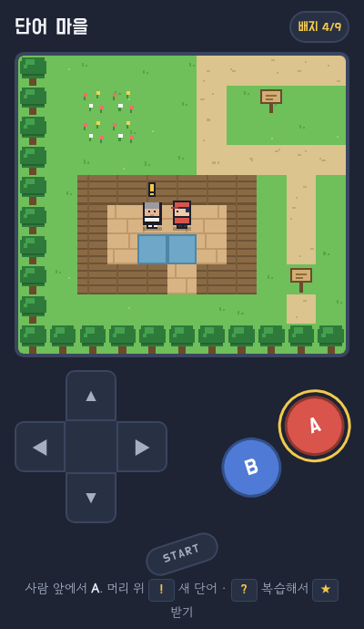
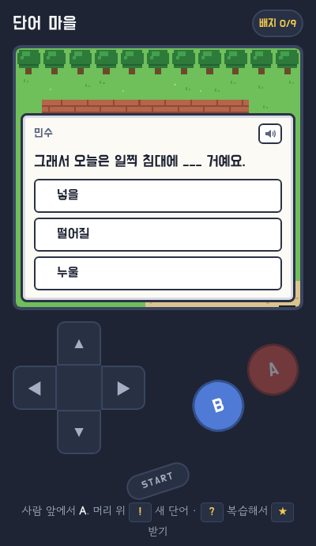
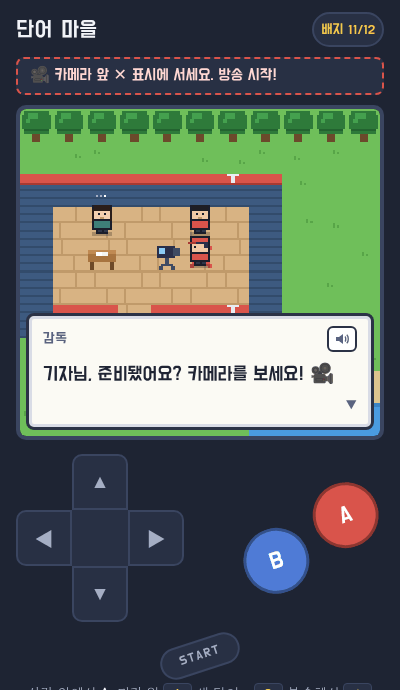
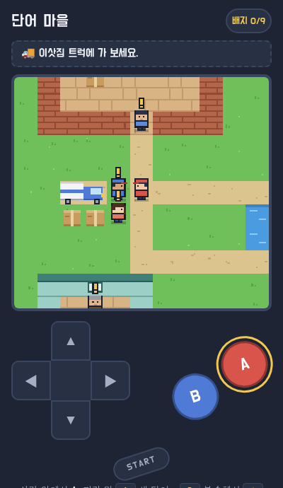
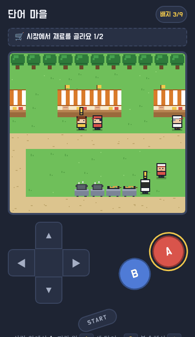
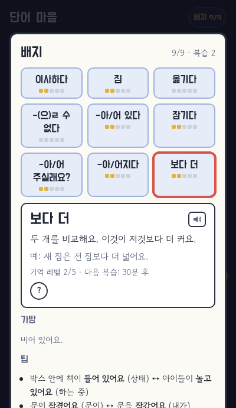

# 단어 마을

A tiny Pokémon-style Korean vocabulary village: walk around, talk to people, answer in Korean, earn badges. Twelve cartridges (편),
each its own village, story and save: 1편 경기장과 도장 · 2편 도서관과 카페 · 3편 연구소와 포켓몬 센터 · 4편 체육관과 수리점 ·
5편 파고 뉴스 · 6편 복습 학교 · 7편 한국 뉴스 · 8편 가을 축제 · 9편 황사 오는 날 · 10편 이사하는 날 · 11편 요리 대회 ·
12편 강가 대청소.

**Play:** https://stan-stani.github.io/daneo-maul/ (built for phones; arrow keys + Z/X and M for the menu on a keyboard)

| | | |
|:-:|:-:|:-:|
|  |  |  |
| 1편 · 경기장과 도장 | Quizzes in every conversation | 7편 · 한국 뉴스 |
|  |  |  |
| 10편 · 이사하는 날 | 11편 · 요리 대회 | 배지: memory levels, tips |

- People with **!** teach new words through quizzes; each word you earn is a badge. Words come back for review as a **?** over
  their teacher when they're due (spaced repetition, five memory levels); level 3 earns the word its ★.
- Tap any Korean word for a simple Korean definition; English is behind the **?** button. The START menu has the conversation
  log (대화), every word you looked up (사전), the cartridge list, read-aloud, sound and 문제 알리기.
- Runs on the shared [walk engine](https://github.com/Stan-Stani/walk-engine) of the sister games
  [성실호](https://github.com/Stan-Stani/seongsilho), [형제](https://github.com/Stan-Stani/hyeongje) and
  [점심 방송](https://github.com/Stan-Stani/jeomsim-bangsong), drawn in 단어 마을's own simpler style.

## Files
- `src/chapters/cN.js` — the cartridges, one per file. `docs/CHAPTER_GUIDE.md` explains how to write one.
- `src/village.js` — 단어 마을's own art (tiles, villagers, dogs, ! ? ★ markers); `src/kit.js` — helpers every cartridge uses.
- `src/shell.html` (the page), `src/game.js` (this game's engine settings), `src/engine.js` (GENERATED from walk-engine; never edit).
- `lexicon/` — the tap-a-word dictionary: `extract.py` maps every word to its dictionary form(s) (Kiwi analyzer), `defs.json`
  holds the learner definitions shared with the sister games.
- `build.py` writes `index.html`. Tests: `node tests/validate.mjs`, `node tests/coverage.mjs cN`, `node tests/play.mjs cN`
  (plays `tests/walk/cN.js` in headless Chrome). `tools/pixelcheck.mjs` compares the drawing with the old engine's.
- `src/daneo-maul.html`, `tools/build_legacy.py`, `tests/legacy/` — the game before the move to the walk engine, kept for reference.
